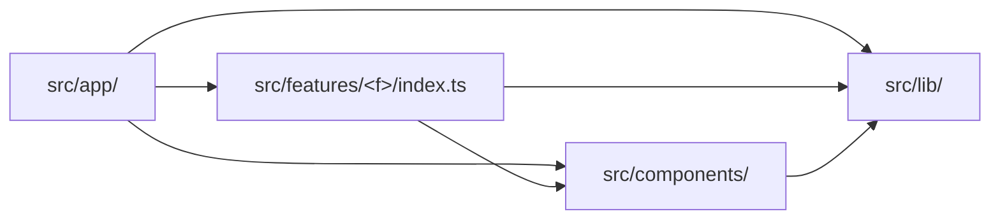

# Coding guidelines

This document is the concrete rulebook: specific, example-driven, "do this, not
that". [architecture.md](architecture.md) keeps the principles and the reasoning
behind the shape of the tree — read it for *why*; read this for what to type.
[testing.md](testing.md) sets the standard for what must be tested.

**A rule here names the file that motivated it.** This repo is new, so most
rules arrive carried over from a sibling project rather than grown here, and
they say so by naming no file yet. That is a debt, not a style: the first time a
rule meets a real file in this tree, add the citation. A rule this project never
finds a reason for does not belong in this document — delete it rather than
leaving it as decoration.

Each rule is tagged:

- *lint-enforced* — `npm run lint` fails on a violation. The rule that does most
  of that work is `import/no-restricted-paths` in `eslint.config.mjs`, for the
  import graph; see [Enforcement](#enforcement).
- *human-checked* — no linter checks it; a reviewer does. Some are additionally
  guarded by tests that read the tree from disk, but a test is not a linter, so
  the tag stays honest.

---

## The design system

`src/components/` holds five role folders plus `tokens.ts`. The folders are
navigational, not import boundaries — any component may use any other component
and `tokens.ts` regardless of group.

**Put a new component in the group that matches its role, and pick the group by
the one-line test.**

| Group | The test |
| :-- | :-- |
| `layout/` | Does it only arrange its children — spacing, direction, the page frame — and render no content of its own? |
| `surfaces/` | Is it a background other content sits *on*: a border, a fill, a gradient? |
| `controls/` | Does the user press, toggle or select it? |
| `typography/` | Is it text styling and nothing else? |
| `display/` | Does it render a value read-only — no input, no children to arrange? |

`tokens.ts` stays at the root of `src/components/`, outside every group: it is
the system's shared vocabulary, not a component. Put the closed spacing scale
there and have the layout primitives take it instead of a raw length, so a
caller can never smuggle an arbitrary spacing decision in from outside.

*human-checked* — a structural test under `src/components/` should assert the
placement once the groups exist.

**Name a design-system component for what it is, never for where it is used.**
No name under `src/components/` carries a domain word. Write `Button`, not
`StartButton`; `Card`, not `TempoCard`. Domain naming belongs to the feature,
where `TempoCard` composes `Card` rather than replacing it.

*human-checked* — a linter cannot tell a generic noun from a domain one.

**Nothing under `src/components/` may import from `src/features/`.** The
dependency runs one way only. If a primitive seems to need a feature's type, the
type is in the wrong place — lift it to `src/lib/`, or pass it in as a prop.

*lint-enforced* (zone 1).

**Inside `src/components/`, import a sibling in your own group relatively and a
component in another group through the `@/` alias. No specifier begins with
`../`.** Crossing a group boundary must read as crossing one:

```ts
// src/components/controls/ChipGroup.tsx
import { Chip } from './Chip'                                        // same group
import { EyebrowLabel } from '@/components/typography/EyebrowLabel'  // crossing

// not this
import { EyebrowLabel } from '../typography/EyebrowLabel'
```

*human-checked* — assert it with a "no import that climbs out of its own folder"
case in the design system's structural test.

**No barrel files under `src/components/`.** No `index.ts` in any group and none
at the root; import each component from its own path. A barrel lets one import
pull in the whole design system — every consumer of `Button` would drag in the
rest — and the grouping would stop telling a reader anything, because every path
would end at the barrel.

A feature's `lib/` folder is the case where the opposite holds — see
[A concern folder earns a door](#feature-slices). A primitive is one of twenty
interchangeable pieces; a concern folder is one seam with a job, and naming the
job is what its `index.ts` is for.

*human-checked* — lock it in with a "has no barrel files" case in the structural
test.

---

## Feature slices

A feature folder separates its concerns by folder, not by convention:
`components/`, `hooks/`, `state/`, `data/` and `lib/`, with `types.ts` and
`index.ts` at the root.

**Reach a feature only through its `index.ts` — tests included.** From outside
`src/features/<feature>/`, import `@/features/<feature>` and nothing deeper.
Read the index rather than any prose list of what it exports; the file is the
surface. If you need something the index does not export, export it there rather
than reaching past it.

The rule binds consumers, not the feature itself: inside its own folder a
feature's files import each other freely by relative path. `index.ts` is the
surface for the outside world, not an internal routing table.

**A test is a consumer, and this is the rule tests break first.** A route test
that deep-imports a slice's internals — or `vi.mock`s one of its paths — means
deleting the slice breaks the route's *tests* however clean the route is. A
mocked path counts: `vi.mock` names a module by path and breaks with it, while
looking like setup rather than coupling. Lint cannot see a `vi.mock`, so guard
the routes with a structural test that reads them from disk and fails on any
specifier — or mock path — that is not exactly `@/features/<feature>`.

*lint-enforced* (zone 2), plus that structural test for the mock case.

**No feature may import another feature — not even through its `index.ts`.**
Anything two slices both need moves *up* into `src/lib/` (logic) or
`src/components/` (UI), never sideways. A sideways import is what makes a slice
undeletable, and the zone is generated per feature, so the second slice inherits
it with no config edit.

*lint-enforced* (zone 3) — it encodes the removability standard in
[architecture.md](architecture.md).

**Put a `lib/` module in the concern folder that matches what it computes.**
`lib/` holds business logic only. Name the concern folders after what this app
actually does rather than after a generic layer cake — for a metronome that is
likely to mean a folder for the timing and scheduling rules, one for the sound,
one for what is stored, and one for turning state into what the UI says.

A module that does not fit any of them is a signal, not an exception: it is
either two modules, or it belongs in `state/` or `data/`. Adding a folder is
fine when the concern is genuinely separate — the test is that you can say in
one line what it decides, and that the line does not already belong to another
folder.

*human-checked*.

**Business logic does not touch the DOM, `window`, or the audio device.** A
`lib/` module is a plain function of its arguments wherever it can be. The
adapter that owns an `AudioContext`, a `localStorage` key or a timer is one
named module behind one seam; everything that decides *what* to schedule or
store is testable without any of them.

*lint-enforced in part* (zone 6 stops a `lib/` module importing UI), the rest
*human-checked* — a constructor call is not an import.

**A concern folder earns a door, and a door lists its exports by name.** A
*door* is a concern folder's `index.ts`. It exports precisely the names its
consumers import through it, written out one by one — never `export *`. An
export nobody imports is a line to delete, and a barrel is worse than no door at
all: it would let the composer read as one tidy import while reaching exactly as
far as before, so the fan-in rule below would pass and the coupling would be
invisible.

**A door is earned by measured growth, not granted by policy.** The question to
ask before adding one is: *has the fan-in into this folder only gone up?* A
folder that went from two modules to eleven while the composer's imports into it
climbed 2 → 3 → 4 → 6 and never came back down has earned a door. One that has
sat at one or two imports for three releases has not, and its modules are
imported directly.

Be clear about what this costs. Nothing guards the composer's imports into an
undoored folder — no zone, no structural test — so a regrowth there is caught by
review alone. Adding a door later is one `index.ts` plus one entry in the
guard's ignore list, so the cheap thing is to add it when a folder grows, not to
write four doors now.

This is the half of the [no-barrel rule](#the-design-system) that does *not*
transfer, and the difference is worth stating: `src/components/` is a flat
catalogue of interchangeable primitives, so a barrel there would make every path
end at the same place. A feature's concern folder is a seam with a job, so its
`index.ts` is the thing that names the job.

*human-checked* — assert a door's export list against every importer in the
repo, so the guard catches carelessness rather than determination. A test file
counts as an importer.

**Group feature components by the screen region that renders them, and let the
grouping follow the composition tree.** Each region is a subtree of one
composer, which is why no component appears in two of them. The root composer
sits above the regions at the `components/` root and belongs to none: it is the
thing that assembles them. A component used by two regions has stopped being
regional — move it up to the `components/` root, or out to `src/components/` if
the domain naming can be stripped.

**A dev-only folder is not a region.** Anything `pageExtensions` keeps out of
the production build composes itself and stands outside the composer's tree, and
nothing the shipped app renders may import it.

*human-checked* — which region a component belongs to is a judgement about the
screen, not a fact about the import graph, so no linter can make it.

**Generated data lives in `data/`, never in `lib/`.** Nothing distinguishes a
file you may edit from a file that is overwritten on the next render except the
folder it sits in. If anything in this project ever renders a file, its write
target is a path constant and moves with it.

**A generated file is never hand-edited — not even its comments.** Where a
generator exists, verify its output by hashing the whole file including its
banner, so one changed character fails verification. The only correct fix at
that point is to change the input or the generator and re-render.

*human-checked* — nothing in a file's text says it was generated.

**`hooks/` holds only genuine hooks** — modules that call React hooks and are
called during render. A `use` prefix is not the test; calling React hooks is. A
vanilla store factory belongs in `state/`.

*human-checked*.

---

## Shared code (`src/lib/`)

`src/lib/` is not a second junk drawer beside `src/features/<feature>/lib/`. It
holds the code that sits *below* the app: knowledge the app needs that is not
about any one feature.

**A module earns a place in `src/lib/` only if it is pure, dependency-free of
app code, runtime-safe TypeScript, and domain rather than product.** The first
three bars are absolute; the fourth is the one that gets stretched.

- **Pure** — a function of its arguments, with no state, no clock, no
  `localStorage`, no DOM. It returns the same thing in a browser, in jsdom and
  in Node.
- **Dependency-free of app code** — it imports nothing outside `src/lib/`, and
  nothing at all where it can manage that.
- **Runtime-safe TypeScript** — a plain function or a type: no enums, no
  namespaces, no decorators. A module down here should be runnable by a plain
  Node process with no bundler in the way.
- **Domain, not product** — the module is knowledge about the domain, not
  knowledge about this product. What a time signature subdivides into, and how a
  tempo marking maps to beats per minute, are domain; the practice streak, the
  onboarding copy and the stored session are product.

**"Reusable" is not the test, and neither is "used in more than one place".**
The test is whether the knowledge would still be true if this product did not
exist. A 6/8 bar has six eighth notes in an app with no streak and no settings
panel; `shouldShowNudge` does not. Before moving anything down here, answer that
question out loud. If `src/lib/` becomes where a module goes because nobody
wanted to decide which slice owns it, this is the paragraph that let it happen.

*human-checked* — assert that a shared table is declared in exactly one non-test
file under `src/`, by reading the tree from disk, for any table two places would
be tempted to copy.

**No user-facing string is written inside a component. The app's words live in
`src/lib/snippets/`.** A component composes and renders language; it does not
hold it. That is two habits to break, not one, because prose comes in two shapes
and only one of them greps:

```tsx
// not this — a quoted literal
const STEPS = ['Set a tempo', 'Hit start']
<button aria-label="Close how to practise" />

// nor this — JSX text between tags, which a search for quotes never finds
<Heading level={1} size="lg">Not found</Heading>

// this
import { intro } from '@/lib/snippets'
<Heading level={2} size="sm">{intro.title}</Heading>
<button aria-label={intro.closeName} />
```

An `aria-label`, a `title` or an `alt` written inline is the same violation as
visible text: an accessible name is a word the user is read.

Import the area object and read a key off it — `intro.title`, never a
destructure at module scope, so any line tells a reader which area the word came
from. **No file outside `src/lib/snippets/` may write `snippets/en` in a
specifier**: `en/` is the part a second language replaces, and a consumer that
names it pins the app to English. `@/lib/snippets` is the only path a caller
writes.

What this rule does *not* count as a word: glyphs (`▶`, `♩`, `✕`), separators
(`' · '`), URLs, licence identifiers, storage keys, locales and notation
(`'4/4'`, `'Allegro'`, `'120 bpm'`) are data, and they stay in the component
that uses them.

The rule covers feature components and routes. The design system is held to a
stricter version: no file under `src/components/` holds an app word *or* imports
`@/lib/snippets` at all. A primitive takes its labels and its accessible names
as required props, and the caller passes the snippets in.

**Why the words sit down here.** Wording this product chose is product, not
domain, so by the fourth bar alone it would belong to a slice. It is in
`src/lib/` because the three absolute bars all hold, and because a route that
renders words — a `not-found.tsx` — may not import a feature's internals, so
app-wide wording has to sit above the slices.

**What a linter stops, and what it does not.** Nothing mechanical fires on an
inline string in a component. The next inline label is caught in review or not
at all.

*human-checked* — a linter cannot tell `'Allegro'` from `'No streak yet'`.

**`src/lib/` is a leaf: nothing in it may import `src/features/` or
`src/components/`.** Being a leaf is the mechanism, not tidiness: it is what
lets a module down here be imported by anything without dragging a feature in
behind it, and what lets a plain Node process run it.

*lint-enforced* (zone 4).

---

## Comments

**Code should explain itself, so avoid comments.** Don't narrate the code or the
change you just made. Leave a comment only for something genuinely non-obvious —
a workaround, a platform quirk, a ticket reference. Never write prose in a
comment.

The shape to watch for is a comment that restates the line below it, or one that
narrates which feature put it there. Neither survives contact with the next
change — the code moves, the comment stays, and a reader now has two sources of
truth. A name is the cheaper fix: a `soundEnabled` flag read from its own store
does not need a paragraph saying so.

Reasoning worth keeping outlives the file it would sit in, so it goes where a
reader will look for it — [architecture.md](architecture.md) for shape,
[music.md](music.md) for musical and timing decisions, `docs/adr/` for a
decision that constrains work not yet done, and the spec folder for why a
requirement exists. A block comment is the worst place to leave it: nothing
points at it and nothing keeps it true.

*human-checked* — no linter can tell a comment that earns its place from one
that restates the code.

---

## Anti-patterns and their fixes

**No component file constructs an I/O adapter.** A component may *use* audio,
storage or the network; it may not build the thing that touches them. A
`new AudioContext(...)` owner, its node graph and its teardown do not belong in
the file whose job is to arrange controls on a page. The fix has a shape: the
adapter goes to `lib/<concern>/`, a hook owns its lifetime, and the component
takes values. An adapter in a component file cannot be tested without rendering,
cannot be swapped in a test without mocking the component's own module, and is
invisible to anyone reading the folder as a list of concerns.

*human-checked* — a constructor call is not an import, so
`import/no-restricted-paths` cannot see it.

**A test lives beside the code it covers, and asserts that code's subject.**
[testing.md](testing.md) asks for colocation; a deep import from a route's test
file is the usual symptom of breaking it. Assertions about a control's behaviour
sitting in the route's test are assertions nobody looking at the control will
find, and that deleting the feature orphans. Move each one to the file that owns
its subject.

Relocating an assertion does not license rewriting it: one written against the
whole composed page keeps that render, in a `describe('through the composed
page', ...)` block that says so. Rewriting it as an isolated render with
hand-made props is a different assertion wearing the old one's name. Colocation
survives a move: when a module changes folder its test goes with it.

*human-checked*.

**A test that selects a sentence asserts *which* sentence, never what it says.**
The module that decides which line the user sees and the module that decides
what that line says are different modules, and a test in the first that writes
the sentence out has asserted the second one's job — becoming a second place the
wording lives, which a reword has to find.

```ts
// not this — the sentence, copied
expect(selectFeedback(state).message).toBe('Tempo saved.')

// this — this input selects that snippet, which is all the module decides
expect(selectFeedback(state).message).toBe(coaching.tempoSaved)

// a snippet that takes arguments is called with the ones the module passes
expect(hint()).toHaveTextContent(coaching.offBy({ ms: 12 }))
```

*human-checked* by default. A `no-restricted-syntax` block can enforce it inside
one narrow folder — the modules whose job is *selecting* a sentence — matching a
whitespace-bearing string literal passed to `toBe`, `toEqual`, `toContain` or
`toMatch`. **Do not widen that scope.** The whitespace clause is a heuristic,
not a test for language: applied suite-wide it fires on `'4/4 · 120 bpm'` and
every other whitespace-bearing datum. What separates language from data here is
the folder an assertion sits in, and a person reading the diff.

**Unenforced is not the same as permitted.** Every test outside such a block has
a reviewer and nothing more. If a prose literal lands in a component test, that
is the argument for widening the block, and it is one config edit away.

**A component that imports most of its own feature's modules is doing too much.**
The import list is the tell, and it is countable: a composer reaches *down* into
the regions it assembles, so a long list of sideways `../lib/` imports means the
file is holding logic that belongs behind a seam. The fix is to name the seams
the file already has and lift them out — a hook takes the store's creation and
hydration, another takes a device's lifetime and its error flag, and what is
left is the derived view data and the JSX.

Extract along seams the tests are already organised around: if the existing
assertions have to be rewritten to fit the new shape, the split has gone past a
refactor and into a redesign.

**Know that this one does not hold on its own.** In the project these guidelines
came from, the composer was cut three times and grew back twice, and its imports
into one concern folder climbed 2 → 3 → 4 → 6 while nothing was watching. What
eventually guarded it was one folder's worth of its fan-in — the door rule under
[Feature slices](#feature-slices) — and nothing guarded the rest.

*human-checked* — the tell is something a reviewer has to count.

---

## Enforcement

The lint-enforced rules above are `import/no-restricted-paths` in
`eslint.config.mjs`, in one named block, configured as an **error**.

**A boundary is a fact about a path**, so the block is scoped to nothing:
`src/components/` importing `src/features/` is wrong wherever it is written,
test file included.

`basePath` is pinned to `import.meta.dirname`, so the zones resolve against the
repo root whatever directory `eslint` runs from.

The allowed import graph — an arrow is permitted, every pair not drawn is an
error:



### The zones

`F` below is `src/features/<feature>`.

| # | Zone | Rule it encodes | How it is expressed |
| :-- | :-- | :-- | :-- |
| 1 | `target: src/components`, `from: src/features` | The design system may not know about features | one static zone |
| 2 | `target:` everything outside the slice, `from: F`, `except: ['index.ts']` | A feature is reached only through its `index.ts` | one zone **per feature**, generated |
| 3 | `target:` the sibling features, `from: F`, no `except` | No feature imports another, not even its `index.ts` | one zone **per feature**, generated |
| 4 | `target: src/lib`, `from: ['src/features', 'src/components']` | `src/lib/` is a leaf | one static zone |
| 6 | `target: F/lib`, `from: ['src/components', 'F/components', 'F/hooks', 'F/state']` | No `lib/` module imports UI, a hook or the store. Business logic does not depend on what renders it | one static zone |

Numbering skips 5 deliberately: in the project these zones came from, zone 5
held an offline generator out of the app tree. This project has no generator, so
the zone does not exist. The gap is kept so a reader comparing the two configs
does not have to renumber anything.

**Zones inside a slice come later.** Zone 6 is the first whose `target` and
`from` are both inside one feature; more of them — the arrows *between* a
slice's concern folders — are worth writing only once
[architecture.md](architecture.md#the-arrows-inside-a-slice) has a map to encode,
and they take the next free numbers.

Five things about that table are easy to get wrong:

**Zones 2 and 3 are generated from `readdirSync('src/features')`, not
hard-coded.** Add a second slice and it gets both boundaries with no config
edit. This matters most for zone 3, which would silently stop existing if the
sibling list were maintained by hand: with one feature its `target` list is
empty and the zone is inert, and it only becomes load-bearing at exactly the
moment someone forgets to update it.

**The feature carve-out is expressed by zone 2's `target`, not by an
exception.** The `target` list enumerates the places *outside* the feature. A
file inside the slice is in no zone's target, so its own relative imports are
never examined. `except: ['index.ts']` is the separate, smaller thing: it is
what lets the listed consumers reach the public surface at all.

**The zones bind test files exactly as they bind source.** The block carries no
`files` key, and nothing exempts `*.test.ts(x)`. This is the part that matters
most: boundary violations are usually found in tests.

**But only what lint can see, which in a test file is less than you would
hope.** `import/no-restricted-paths` reads import and require specifiers, so a
`vi.mock('../other-concern/module')` passes lint with zero errors though it
violates the zone exactly as the import would. The rule still binds it; the
linter is simply not the thing that catches it. When a boundary matters in a
test, the guard is a structural test that reads the file from disk and matches
`vi.mock` paths itself.

**Every zone carries a `message` that names the rule and the reason**, not just
the restricted path, because a lint error is where most people meet these rules
first.

### The composer's rule is not a zone

A composer reaching a concern folder only through its `index.ts` is about one
file's specifiers resolving to a door rather than to a sibling in the same
folder, and `import/no-restricted-paths` has no way to express that: the file
and the door are inside the same `target`. It is a structural test instead.

### What lint structurally cannot see

`import/no-restricted-paths` inspects **import and require specifiers only**. It
does not read path strings, a `readFileSync`, a `vi.mock` or a dynamic import.
Where one of those can cross a boundary, the guard is a test that string-scans
the tree. **The two guards are complementary, not redundant** — lint catches the
import a string scan would have to guess at; the scan catches what lint cannot
see. Deleting either one as "duplication" removes a case the other never
covered.

### What is not lint-enforced, and why

The *human-checked* tag is not a softer version of *lint-enforced*; it means the
rule is about meaning rather than about the import graph, so no configuration
would catch it:

| Convention | Where it is stated | Why no linter |
| :-- | :-- | :-- |
| Design-system components are named generically | [The design system](#the-design-system) | `TempoCard` and `Card` are the same shape to a parser |
| No I/O adapter is constructed in a component file | [Anti-patterns](#anti-patterns-and-their-fixes) | `new AudioContext(...)` is a constructor call, not an import |
| Generated data lives in `data/`, never `lib/` | [Feature slices](#feature-slices) | nothing in a file's text says it was generated |
| Feature components are grouped by screen region | [Feature slices](#feature-slices) | which region a component belongs to is a judgement about the screen |
| Comments are avoided unless genuinely non-obvious | [Comments](#comments) | whether a comment restates its code is a judgement about meaning |
| A test does not quote the app's words | [Anti-patterns](#anti-patterns-and-their-fixes) | `'4/4'` and `'Tempo saved.'` are the same shape to a parser; only the folder tells them apart |

Several human-checked rules can have a test standing behind them — a structural
test that reads the tree or the source from disk and fails on drift. Those run
under `npm test`, not `npm run lint`, and none of them replaces a reviewer's
judgement about a rule's intent.
